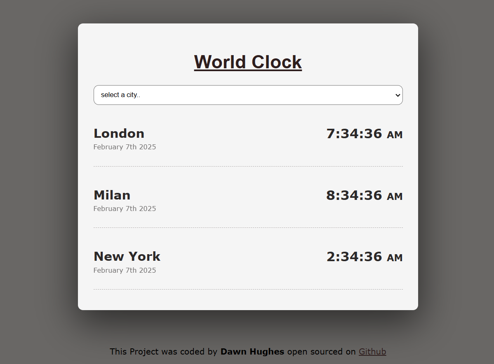

## 🌍 World Clock Project

📌 About This Project

This World Clock project is a major step forward in my web development journey. It showcases my ability to integrate HTML, CSS, and JavaScript to build an interactive web application. 
Unlike my previous projects, this one dynamically updates time zones using Moment.js and Moment Timezone, displaying real-time information for multiple cities.

This project also represents my improved understanding of GitHub, as I have structured and documented my repository more effectively to enhance code readability and accessibility.

## 🚀 Key Features

-- 🌎 Live Time Updates for selected cities around the world

-- ⏳ Dynamically Updates Every Second using setInterval()

-- 🌐 User-Selected City Time Zones with a dropdown menu

-- 📅 Formatted Date and Time using Moment.js

-- 🔄 Auto-detects User's Time Zone

-- 🎨 CSS Styling for an intuitive and visually appealing layout

## 🛠 Technologies Used

-- HTML – Structure and layout of the page

-- CSS – Styling for an engaging UI

-- JavaScript – Dynamic time updates & interactivity

-- Moment.js – Time formatting & manipulation

-- Moment Timezone – Handling multiple time zones

-- GitHub – Version control and project sharing

## 📖 What I Learned & Improved

This project significantly enhanced my development skills, introducing me to:
- ✅ Handling real-time data with JavaScript and Moment.js
- ✅ Manipulating the DOM dynamically to update content on the page
- ✅ Working with external libraries (Moment.js & Moment Timezone) to format and manage time
- ✅ Event listeners and user interaction using the dropdown menu
- ✅ Interval functions (setInterval) to refresh data at regular intervals
- ✅ GitHub repository structuring and improved documentation
- ✅ Writing cleaner, more maintainable code by organizing JavaScript functions effectively

## 📷 Preview

## 🖥️ How to Run the Project

Clone the repository:

git clone https://github.com/FedDawb/NewWorldClock

Open index.html in a web browser.

## 🔮 Future Enhancements

-- 🌍 More Cities: Expand the city selection to include more locations.

-- 🌓 Dark Mode: Add a dark mode option for better accessibility.

-- 🏗 Weather Integration: Incorporate live weather data for each city.

-- 📱 Mobile Responsiveness: Improve UI for different screen sizes.

## 🤝 Connect With Me

I am constantly improving my skills and eager to take on new challenges. 
Feel free to check out my other projects or connect with me!

